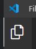
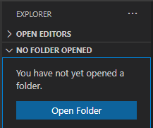
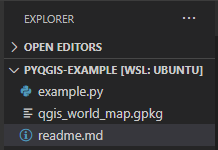
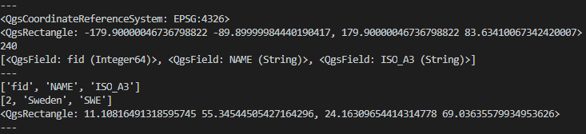

## PyQGIS example environment configuration using Visual Studio Code and WSL2 on Windows 10

This repository contains example of how to configure Visual Studio Code and WSL2 (Linux in Windows) to use QGIS via PyQGIS library.

You can use QGIS engine and algorithms for processing data in Python. If you don't need the GUI - and in most cases when writing these kind of scripts the point is to not use the GUI - it's sometimes easier to configure QGIS in Linux rather than in Windows due to required environment variables setup in Windows. You can leverage great integration of Windows, WSL (kind of virtual machine with Linux running on Windows), and Visual Studio Code which can connect to remote environments - in this case our virtual machine (WSL).

## Instructions:
1. Install WSL2 on your Windows machine. Then install Linux distribution of your choice eg. Ubuntu.  
Official instructions: https://docs.microsoft.com/en-us/windows/wsl/install-win10
1. Install Visual Studio Code.  
Official instructions: https://code.visualstudio.com/
1. Install _Remote - WSL_ plugin for Visual Studio Code.  
Link: https://marketplace.visualstudio.com/items?itemName=ms-vscode-remote.remote-wsl
1. Open Visual Studio Code and click the left lower corner with the >< icon and choose the option _Remote-WSL: New Window_.  

1. Open new terminal by going to _Terminal_ menu then clicking _New Terminal_ or press __CTRL + `__.
1. Update packages in Linux and install QGIS. On ubuntu you would execute commands: _sudo apt update_ then _sudo apt upgrade_ (use the password that you set up in step 1).  
Official QGIS installation instructions: https://qgis.org/en/site/forusers/download.html - follow the ones for the Linux distribution that you chose in step 1 (direct link to ubuntu installation instructions: https://qgis.org/en/site/forusers/alldownloads.html#debian-ubuntu ).

If you want to test this setup you may clone or download this repository from GitHub and unpack it somwhere on you Windows machine. 

In Visual Studio Code in Explorer click _Open Folder_ and choose the location of the unpacked files.

|  
v  

|  
v  

Make sure that you use window that is connected to WSL.

Double click on _example.py_ file then run it using "Play" button in the top right corner.

Code will print a few informations from attached geopackage file.

---

### Some notes:

File qgis_world_map.gpkg is a fragment of file worl_map.gpkg that is inside the QGIS install in _resources/data_ folder. All credits go to QGIS team that prepared it.

Most of the code comes from examples in the documentation of PyQGIS: https://docs.qgis.org/latest/en/docs/pyqgis_developer_cookbook/index.html

Windows can access Linux (WSL) files using network share: "\\\wsl$\\". Linux (WSL) can access files in windows using path: "/mnt/c/" (or any other drive than C:).
